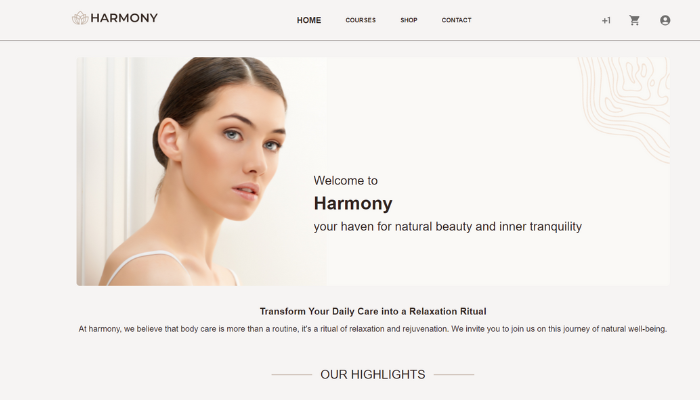

# Harmony - Body care routine

Welcome to my project! This is a showcase of my work and skills in web development, specifically a web page designed for
daily care and well-being.



[Harmony Shop Website](https://harmony-shop.vercel.app/)

## Technologies Used

- React
- React Router Dom
- Redux Toolkit
- TypeScript
- Axios
- Styled Components
- Material UI
- Vite
- Font Awesome Icons
- Swiper
- Vercel

## Getting Started

To run this project locally, follow the steps below:

1. Make sure you have Node.js and npm installed on your machine.
2. Clone from Github ``git clone https://github.com/patriciasegantine/harmony-shop``
3. Navigate to the project directory.
4. Install the dependencies by running the following command: ```` npm install ````

5. Start the development server with the following command:
   ```` npm dev ````

6. This will launch the project in your browser at [http://localhost:4000](http://localhost:4000).

## Build

1. To build the project for production, use the following command: ``` npm build ```

2. This will generate an optimized and minified version of your project in the `dist` directory.

## Acknowledgment:

### ChatGPT:

All text content in this project was generated with the assistance of ChatGPT, a powerful natural language generation
tool developed by OpenAI. I extend my gratitude to OpenAI for their support through this innovative technology.

## Development Note:

### Frontend Development:

Please be aware that this project is still under active development. While we strive to deliver a complete and
feature-rich experience, some functionalities may not be fully operational or meet expectations at this time.

### Backend Implementation:

Please be aware that, as of now, there are no backend implementations in place. However, I have plans to develop backend
functionalities in the near future.

While my current focus remains on the frontend and core features, I am fully committed to expanding my project to
include robust backend components. Stay tuned for updates as I work towards a more comprehensive solution.

I greatly appreciate your patience and support.

Feel free to explore my project, which focuses on daily care and well-being. If you have any questions or would like to
collaborate, please don't hesitate to get in touch!

— Patricia Segantine
